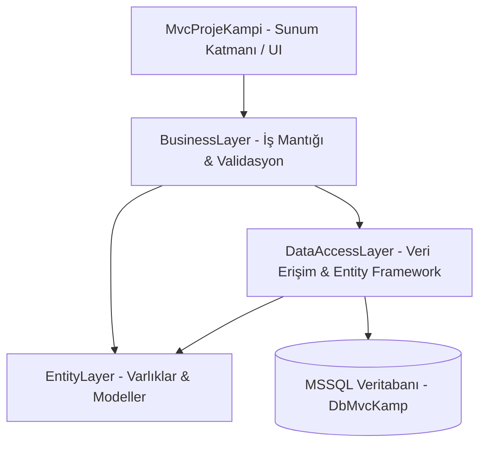

# 📚 Kurumsal Sözlük & Blog Yönetim Sistemi (ASP.NET MVC 5)

[](https://dotnet.microsoft.com/)
[](https://dotnet.microsoft.com/apps/aspnet/mvc)
[](https://docs.microsoft.com/ef/)
[](https://www.microsoft.com/sql-server)
[](https://adminlte.io/)

Bu proje; kurumsal bir **Sözlük, Blog ve Yazar Topluluğu Platformu** olarak tasarlanmış, **N-Tier (Çok Katmanlı Mimari)** prensipleri ve **SOLID** tasarım ilkeleri gözetilerek **ASP.NET MVC 5** ve **Entity Framework Code First** mimarisiyle geliştirilmiş kapsamlı bir web uygulamasıdır.

---

## 📑 İçindekiler
- [Mimari Yapı (N-Tier Architecture)](#-mimari-yapı-n-tier-architecture)
- [Temel Özellikler ve Modüller](#-temel-özellikler-ve-modüller)
  - [1. Yönetici Paneli (Admin)](#1-yönetici-paneli-admin)
  - [2. Yazar Paneli (Writer)](#2-yazar-paneli-writer)
  - [3. Vitrin & Sözlük Arayüzü](#3-vitrin--sözlük-arayüzü)
  - [4. Güvenlik & Doğrulama (Security)](#4-güvenlik--doğrulama-security)
- [Kullanılan Teknolojiler](#-kullanılan-teknolojiler)
- [Veritabanı Kurulumu](#-veritabanı-kurulumu)
- [Projeyi Çalıştırma Adımları](#-projeyi-çalıştırma-adımları)
- [Geliştirici & Lisans](#-geliştirici--lisans)

---

## 🏛️ Mimari Yapı (N-Tier Architecture)

Proje, sorumlulukların ayrılması (Separation of Concerns) ve sürdürülebilirlik amacıyla 4 ana katmana ayrılmıştır:



* **EntityLayer:** Veritabanı tablolarına karşılık gelen POCO sınıflarını (Category, Heading, Content, Writer, Admin, Message, Contact, About, ImageFile) barındırır.
* **DataAccessLayer:** Generic Repository Pattern ve Entity Framework Code First yapılarını barındırır. Veritabanı CRUD işlemleri ve Context yönetimi burada yapılır.
* **BusinessLayer:** İş kuralları, servis arayüzleri (`ICategoryService`, vb.), Manager sınıfları ve **FluentValidation** doğrulama kurallarını yönetir.
* **MvcProjeKampi (UI):** Controller'lar, View'lar, Partial View'lar, AdminLTE tabanlı Admin ve Yazar panelleri ile vitrin arayüzünü sunar.

---

## 🚀 Temel Özellikler ve Modüller

### 1. Yönetici Paneli (Admin)
* **Kategori Yönetimi:** Yeni kategori ekleme, güncelleme, pasife alma (Soft Delete).
* **Başlık Yönetimi:** Başlık oluşturma, düzenleme, duruma göre listeleme ve kategoriye göre filtreleme.
* **İçerik Yönetimi:** Yazarların girdiği tüm entry ve içerikleri denetleme, başlığa veya yazara göre içerik listeleme.
* **Yazar Yönetimi:** Sistemdeki yazarları listeleme, durumlarını aktifleştirme/pasifleştirme, yetkilendirme.
* **Mesajlaşma & İletişim:** Gelen kutusu, giden kutusu, taslaklar, çöp kutusu ve okunma durumu yönetimi.
* **Yetkilendirme & Rol Yönetimi:** Özel Rol Sağlayıcı (`AdminRoleProvider`) ile admin yetkilendirme (A, B, C rolleri).
* **Grafikler & Raporlama:** Google Charts entegrasyonu ile kategori bazlı dinamik içerik dağılım grafikleri.
* **Galeri & Dosya Yönetimi:** Sistem görsellerinin dinamik olarak listelenmesi.

### 2. Yazar Paneli (Writer)
* **Profil Yönetimi:** Yazar kişisel bilgileri, biyografi ve şifre güncelleme.
* **Başlıklarım:** Yazarın kendi açtığı başlıkları tek ekranda görmesi ve yönetmesi.
* **Yazılarım / Entry Yönetimi:** Yazarın kendi girdiği yorumları düzenleyebilmesi ve yeni entry eklemesi.
* **Mesajlaşma:** Diğer yazarlar veya admin ile sistem üzerinden mesajlaşma (Inbox, Sendbox, Taslak kaydetme).

### 3. Vitrin & Sözlük Arayüzü
* **Dinamik Sözlük Akışı:** Ziyaretçilerin başlıkları ve entry'leri kategori bazında okuyabildiği modern arayüz.
* **Karşılama / Vitrin Sayfası:** Projeyi, platformu ve yazarları tanıtan landing page.
* **İletişim & Başvuru:** Ziyaretçilerin site yönetimiyle iletişime geçebileceği form altyapısı.

### 4. Güvenlik & Doğrulama (Security)
* **Forms Authentication:** Güvenli oturum açma ve Session yönetimi.
* **Yetkilendirme:** Role-based erişim kontrolü (`[Authorize(Roles = "A")]`).
* **Şifreleme:** MD5 / Hash tabanlı şifre güvenliği (`HashHelper`).
* **Doğrulama (Validation):** FluentValidation ile kurumsal seviyede form ve girdi doğrulaması.
* **Veri Güvenliği (Soft Delete):** Verilerin fiziksel olarak silinmesi yerine durumlarının (`Status = false`) pasife çekilerek korunması.

---

## 🛠️ Kullanılan Teknolojiler

| Alan | Teknoloji / Kütüphane |
| :--- | :--- |
| **Framework** | .NET Framework 4.7.2 |
| **Web Mimarisi** | ASP.NET MVC 5 |
| **ORM** | Entity Framework 6 (Code First & Migrations) |
| **Veritabanı** | Microsoft SQL Server |
| **Doğrulama** | FluentValidation |
| **Ön Yüz Tasarımı** | Bootstrap 4, AdminLTE 3.0.4, FontAwesome |
| **Grafikler** | Google Charts API |
| **Sayfalama** | PagedList.Mvc |

---

## 💾 Veritabanı Kurulumu

Proje içerisinde yer alan hazır veritabanı dosyaları `Database/` klasöründe sunulmuştur:

* **Script Yolu:** `Database/DbMvcKamp_Script.sql`
* **Backup Yolu:** `Database/DbMvcKamp.bak`

### SQL Script ile Kurulum (Önerilen):
1. **SQL Server Management Studio (SSMS)** uygulamasını açın.
2. `Database/DbMvcKamp_Script.sql` dosyasını SSMS içine sürükleyip açın.
3. **Execute (F5)** butonuna basarak veritabanını, tabloları ve örnek verileri tek adımda oluşturun.
4. `MvcProjeKampi/Web.config` dosyasındaki `Context` connection string alanını kendi sunucu adınıza göre düzenleyin:
   ```xml
   <connectionStrings>
     <add name="Context" connectionString="data source=.;initial catalog=DbMvcKamp;integrated security=true;" providerName="System.Data.SqlClient" />
   </connectionStrings>
   ```

---

## 🏃 Projeyi Çalıştırma Adımları

1. Projeyi Visual Studio ile açın (`MvcProjeKampi.sln`).
2. Gerekli NuGet paketlerini geri yükleyin:
   ```
   Tools -> NuGet Package Manager -> Manage NuGet Packages for Solution -> Restore
   ```
3. `MvcProjeKampi` projesine sağ tıklayıp **Set as Startup Project** seçin.
4. Projeyi `Ctrl + F5` ile derleyip çalıştırın.

### Test / Giriş Bilgileri

| Panel | Kullanıcı Adı / E-Posta | Rol / Unvan |
| :--- | :--- | :--- |
| **Admin Paneli** | `admin@gmail.com` | **C** (Kurucu Admin) |
| **Admin Paneli** | `editor@gmail.com` | **A** (Editör) |
| **Yazar Paneli** | `yazar@gmail.com` | Yazar |

---

## 👨‍💻 Geliştirici & Lisans

* Geliştirici: **ALİ BARAN**
* Mimari: **ASP.NET MVC 5 & Kurumsal Katmanlı Mimari**
* Bu proje eğitim, portfolyo ve açık kaynak paylaşım amacıyla hazırlanmıştır. Herhangi bir lisans kısıtlaması olmaksızın referans alınabilir.
